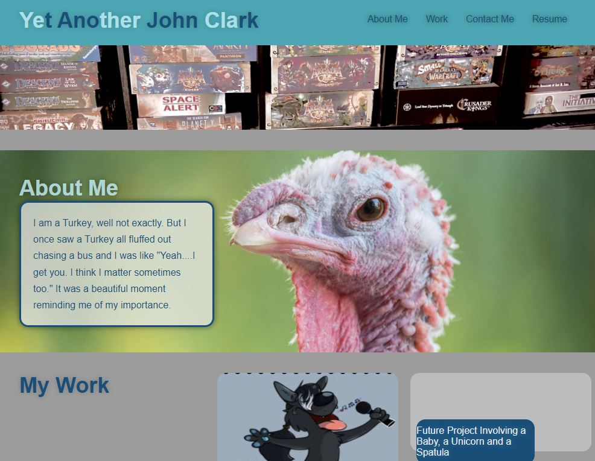

# Professional Portfolio 

## Description

This is my second challenge for the UofU bootcamp.  In it you will find what I plan on being the first draft of my porfessional portfolio.  In it you will find a link to the first thing I ever made and then two placeholders for the future.  You also get a link to my LinkedIn and a spot to link you to my resume once I revisit and update it.

## What I Learned

Honestly a ton.  This was my first time I really tried to build a page from the ground up with the intention of trying to make it look good....or well better than my first project.  You'll see a pretty massive difference between this page and my first page which is linked in the Portfolio.  Hope you enjoy this as I continue to grow and learn new things

https://johnknee3.github.io/Professional-Portfolio/
